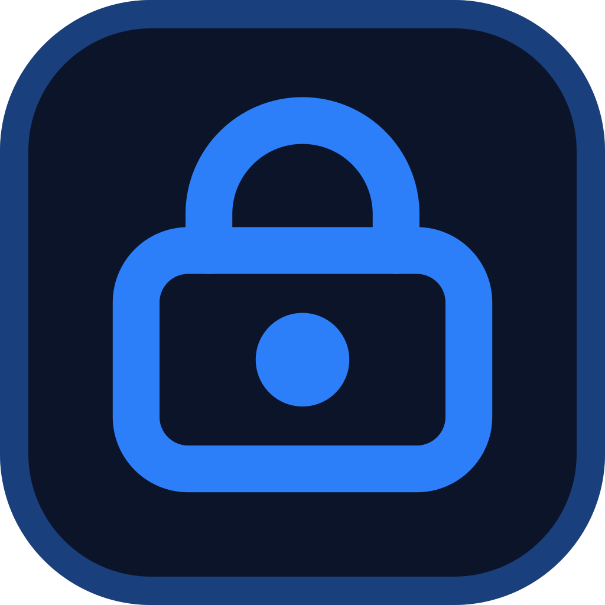

  

<h1 align="center">SafeBox</h1>

  <strong>Secure P2P Connection, Chat & File Sharing for Windows</strong> 
  <em>Təhlükəsiz P2P Əlaqə, Söhbət və Fayl Paylaşımı proqramı</em>

---

## 🇬🇧 English

### Overview
**SafeBox** is a modern, beautifully designed desktop application built with Electron that allows two users to establish a secure, end-to-end encrypted peer-to-peer (P2P) connection. With no third-party servers storing your data, SafeBox ensures absolute privacy for your conversations and file transfers.

### ✨ Features
- **Direct P2P Connection:** Connect directly to another PC using a secure, dynamically generated connection code.
- **End-to-End Encryption:** All communications and file transfers are secured using industry-standard **AES-256-GCM** and **X25519 ECDH** cryptography.
- **Real-time Chat:** Send and receive encrypted text messages instantly without any chat history being saved to a server.
- **Secure File Sharing:** Transfer files of any size directly between peers. Downloads are saved securely in your local `Downloads/SafeBox` folder.
- **UPnP Support:** Automatic port forwarding to easily establish connections across the internet (WAN).
- **Premium UI:** A stunning, modern dark theme interface with glassmorphism, micro-animations, and a highly responsive design.

---

## 🇦🇿 Azərbaycanca

### Ümumi Baxış
**SafeBox** — istifadəçilərə təhlükəsiz, ucdan-uca şifrələnmiş peer-to-peer (P2P) bağlantısı qurmağa imkan verən, Electron ilə hazırlanmış müasir və gözəl dizaynlı masaüstü tətbiqidir. Heç bir üçüncü tərəf serveri məlumatlarınızı saxlamır, SafeBox söhbətlərinizin və fayl transferlərinizin mütləq məxfiliyini təmin edir.

### ✨ Xüsusiyyətlər
- **Birbaşa P2P Əlaqə:** Dinamik olaraq yaradılmış təhlükəsiz kod vasitəsilə başqa bir kompüterə birbaşa qoşulun.
- **Ucdan-Uca Şifrələmə:** Bütün əlaqələr və fayl köçürmələri **AES-256-GCM** və **X25519 ECDH** kriptoqrafiyası ilə tam şifrələnir.
- **Canlı Söhbət (Chat):** Şifrələnmiş mətn mesajlarını anında göndərin. Heç bir danışıq tarixçəsi serverdə saxlanılmır.
- **Təhlükəsiz Fayl Paylaşımı:** İki kompüter arasında birbaşa, istənilən ölçüdə fayl göndərib-alın. Yüklənmiş fayllar birbaşa sizin `İndirilenler/SafeBox` qovluğuna düşür.
- **UPnP Dəstəyi:** Şəbəkə xarici (İnternet/WAN) əlaqələr qurmaq üçün avtomatik port yönləndirilməsi (port forwarding).
- **Premium Dizayn:** Xüsusi detallı, animasiyalı, şüşə (glassmorphism) effektli və müasir "Dark Theme" interfeysi.

---

## 🛠️ Technologies / Texnologiyalar

- **Electron & Node.js** - Desktop framework / Masaüstü təməl çərçivə
- **Vanilla JS, HTML5, CSS3** - Frontend (No external heavy frameworks / Əlavə ağır kitabxanalar olmadan)
- **WebSocket** - Real-time UI-to-Backend communication / İnterfeys və arxa uc arasında canlı əlaqə
- **Native Crypto** - Built-in Node.js `crypto` for maximum security / Yüksək təhlükəsizlik üçün daxili kriptoqrafiya modulu

---

## 🚀 Installation & Usage / Quraşdırma və İstifadə

### Prerequisites / Tələblər
- [Node.js](https://nodejs.org/) installed on your machine / Kompüterinizdə quraşdırılmış olmalıdır.

### Setup / Quraşdırma
\`\`\`bash
# Clone or download the repository / Layihəni yükləyin və qovluğa daxil olun
cd SafeBox

# Install dependencies / Lazımi paketləri yükləyin
npm install
\`\`\`

### Running Locally / İşə Salmaq (Test üçün)
\`\`\`bash
# Start the app in development mode / Proqramı test rejimində açın
npm run dev
\`\`\`

### Building / Setup Faylı Yaratmaq
\`\`\`bash
# Build the Windows executable (.exe) / Windows üçün quraşdırma faylı (.exe) yaratmaq
npm run dist
\`\`\`
*The installer will be generated in the `dist` folder.* / *Setup faylı `dist` qovluğunda yaranacaq.*

---

## 📸 Screenshots / Ekran Görüntüləri

<b>SafeBox Setup / Quraşdırma Ekranı</b>

 

<b>Welcome & Connection / Xoş Gəldiniz və Əlaqə</b>

 

<b>Secure File Sharing / Təhlükəsiz Fayl Paylaşımı</b>

 

<b>Encrypted Chat / Şifrələnmiş Söhbət</b>

 

*(Qeyd: Zəhmət olmasa, əlavə etdiyiniz ekran görüntülərini `screenshots` adlı qovluq yaradıb daxilinə `setup.png`, `welcome.png`, `file-sharing.png` və `chat.png` adları ilə yaddaşda saxlayın ki, README faylında görünsünlər.)*

---

  Developed by <b>rauffathigovashin</b>

